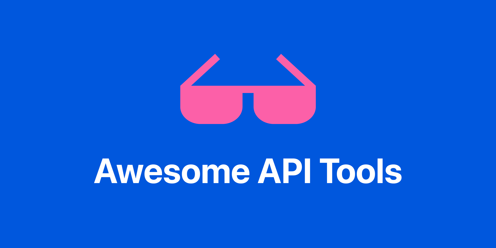

# Awesome API Tools

> A curated list of awesome bookmarks, tools, tutorials, and other cool resources for the API ecosystem

## Table of Contents

- [Table of Contents](#table-of-contents)
- [API Automation & Testing](#automation)
- [API Catalog](#catalog)
- [API Documentation](#documentation)
- [API Monitoring](#monitoring)
- [API Observability](#observability)
- [API Security](#security)
- [Misc. API Tools](#misc)

## Automation

- [**Eggplant**](https://www.keysight.com/)
- [**Katalon**](https://katalon.com/)
- [**mabl**](https://www.mabl.com/)
- [**Postman**](https://www.postman.com/)
- [**SoapUI**](https://www.soapui.org/)
- [**Tricentis**](https://www.tricentis.com/)
- [**UP9**](https://up9.com/)

## Catalog

- [**Backstage**](https://backstage.io/)
- [**Buf**](https://buf.build/)
- [**configure8**](https://www.configure8.io/)
- [**Cortex**](https://www.cortex.io/)
- [**DeployHub**](https://www.deployhub.com/)
- [**Kong**](https://konghq.com/)
- [**OpsLevel**](https://www.opslevel.com/)
- [**Postman**](https://www.postman.com/)
- [**RapidAPI Hub**](https://rapidapi.com/hub)
- [**Stoplight**](https://stoplight.io/)
- [**Swaggerhub**](https://swagger.io/)
- [**Treblle**](https://www.treblle.com/)

## Documentation

- [**Postman**](https://www.postman.com/)
- [**ReadMe**](https://readme.com/)
- [**Redocly**](https://redocly.com/)
- [**Stoplight**](https://stoplight.io/)
- [**SwaggerHub**](https://swagger.io/)
- [**Treblle**](https://www.treblle.com/)

## Monitoring

- [**AlertSite**](https://smartbear.com/product/alertsite/web-monitoring/)
- [**Catchpoint**](https://www.catchpoint.com/)
- [**Checkly**](https://www.checklyhq.com/)
- [**Datadog**](https://www.datadoghq.com)
- [**Postman**](https://www.postman.com/)
- [**Runscope**](https://www.runscope.com/)
- [**Sauce Labs**](https://saucelabs.com/)
- [**Treblle**](https://www.treblle.com/)

## Observability

- [**Akana**](https://www.akana.com/)
- [**Akita**](https://www.akitasoftware.com/)
- [**APIMetrics**](https://apimetrics.io/)
- [**Buf**](https://buf.build/)
- [**Moesif**](https://www.moesif.com/)
- [**Treblle**](https://www.treblle.com/)
- [**Uptrends**](https://www.uptrends.com/)

## Security

- [**42Crunch**](https://42crunch.com/)
- [**APIsec**](https://www.apisec.ai/)
- [**Cequence**](https://www.cequence.ai/)
- [**Imperva**](https://www.imperva.com/)
- [**Neosec**](https://www.akamai.com/)
- [**Noname**](https://nonamesecurity.com/)
- [**Postman**](https://www.postman.com/)
- [**Salt Security**](https://salt.security/)
- [**StackHawk**](https://www.stackhawk.com/)
- [**Traceable**](https://www.traceable.ai/)
- [**Treblle**](https://www.treblle.com/)
- [**Veracode**](https://www.veracode.com/)
- [**Wallarm**](https://www.wallarm.com/)
- [**Wib**](https://wib.com/)

## Misc

